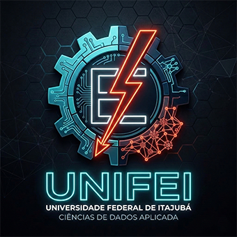

<div align="center">



# ✦ Design Portfolio

### UI/UX · Branding · Visual Design

[](https://figma.com)
[](https://behance.net)
[](https://linkedin.com)

</div>

---

## 👋 Sobre Mim

Olá! Sou um(a) Designer com foco em criar experiências digitais significativas, centradas no usuário e com identidade visual forte. Atuo nas frentes de **UI/UX Design**, **Branding** e **Visual Design**, unindo raciocínio estratégico com execução estética cuidadosa.

> *"Design não é só como algo parece. É como algo funciona."* — Steve Jobs

Neste repositório você encontrará meus projetos documentados end-to-end: do briefing à entrega, passando por pesquisa, wireframes, protótipos e resultados mensuráveis.

---

## 🛠 Ferramentas

| Categoria | Ferramentas |
|---|---|
| **UI/UX Design** | Figma, Adobe XD |
| **Branding & Ilustração** | Adobe Illustrator, Affinity Designer |
| **Prototipação** | Figma (Interactive), Marvel, InVision |
| **Motion & Vídeo** | After Effects, Lottie |
| **Pesquisa** | Maze, Hotjar, Miro |
| **Handoff & Documentação** | Zeroheight, Notion, GitHub |
| **Imagem** | Adobe Photoshop, Lightroom |

---

## 🗂 Como Navegar pelos Projetos

```
Design/
├── projects/
│   ├── ui-ux/          ← Produtos digitais, apps e interfaces
│   ├── branding/       ← Identidades visuais e sistemas de marca
│   └── visual-design/  ← Peças gráficas, motion e ilustrações
├── assets/             ← Recursos globais (fontes, ícones, paletas)
└── docs/               ← Guias, checklists e documentação de processo
```

Cada projeto segue o padrão de **Case Study** com:
- 📌 Contexto e briefing
- 🔍 Pesquisa e descoberta
- 💡 Ideação e processo
- 🎨 Solução e entregáveis
- 📊 Resultados e aprendizados

---

## 🚀 Projetos em Destaque

| Projeto | Categoria | Status | Link |
|---|---|---|---|
| *Em breve* | UI/UX | 🟡 Em andamento | — |
| *Em breve* | Branding | 🟡 Em andamento | — |
| [Coletânea de Artes Visuais](projects/visual-design/artworks-collection) | Visual Design | 🟢 Concluído | [Ver Case](projects/visual-design/artworks-collection) |

> **Dica de navegação:** cada pasta de projeto contém um `README.md` com o case completo, links para protótipos navegáveis no Figma e os entregáveis finais.

---

## 📁 Estrutura do Repositório

```
Design/
├── README.md                    ← Você está aqui
├── projects/
│   ├── ui-ux/
│   │   └── [nome-do-projeto]/
│   │       ├── README.md        ← Case study completo
│   │       ├── assets/          ← Imagens, ícones do projeto
│   │       ├── prototypes/      ← Links e arquivos de protótipo
│   │       └── deliverables/    ← Entregáveis finais
│   ├── branding/
│   │   └── [nome-do-projeto]/
│   └── visual-design/
│       └── [nome-do-projeto]/
├── assets/
│   ├── brand/                   ← Logo e identidade deste portfólio
│   ├── icons/                   ← Ícones reutilizáveis
│   ├── images/                  ← Imagens gerais
│   └── fonts/                   ← Tipografias utilizadas
└── docs/
    ├── case-study-guide.md      ← Guia de apresentação de cases
    ├── visual-guidelines.md     ← Padrões visuais do portfólio
    └── presentation-checklist.md← Checklist por projeto
```

---

## 📬 Contato

Adoraria ouvir seu feedback ou conversar sobre novas oportunidades!

- 📧 **E-mail:** [seu@email.com](mailto:seu@email.com)
- 💼 **LinkedIn:** [linkedin.com/in/seuperfil](https://linkedin.com)
- 🎨 **Behance:** [behance.net/seuperfil](https://behance.net)
- 🖌 **Figma Community:** [figma.com/@seuperfil](https://figma.com)

---

<div align="center">

*Se este repositório te inspirou ou você quer trocar uma ideia sobre algum projeto, abre uma [Issue](../../issues) ou me manda uma mensagem. Feedbacks são sempre bem-vindos!* 🙌

</div>