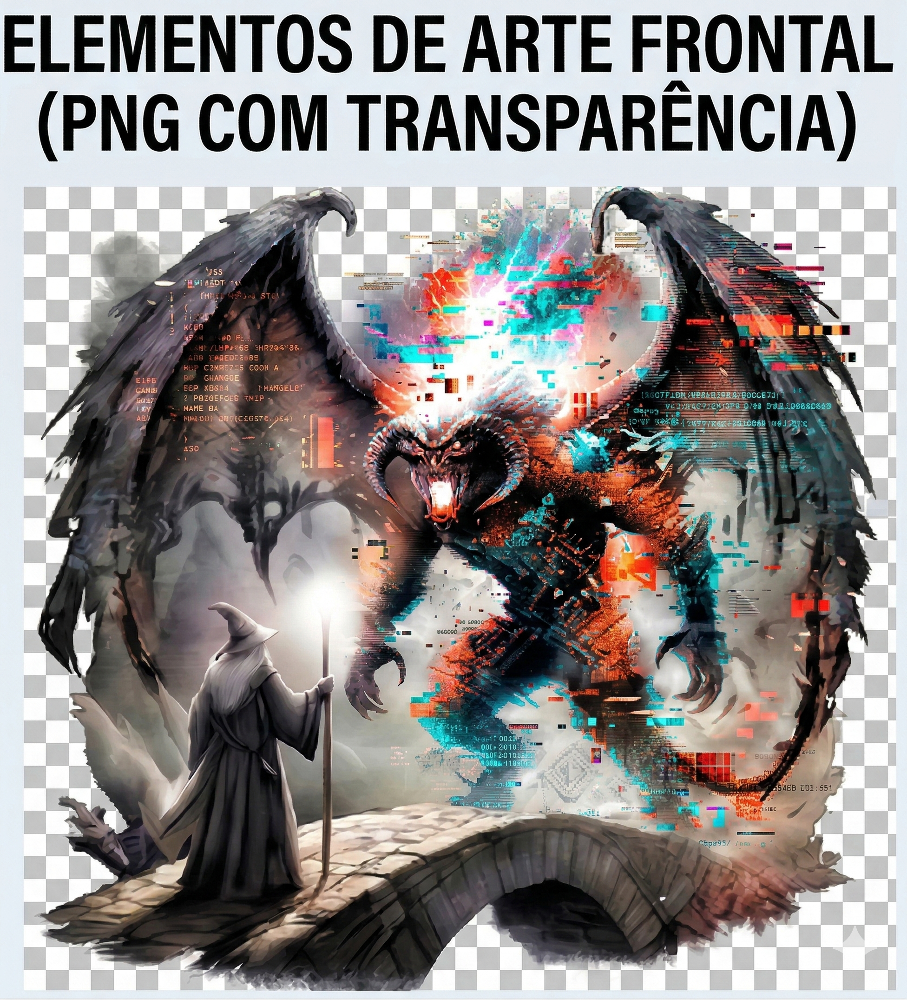
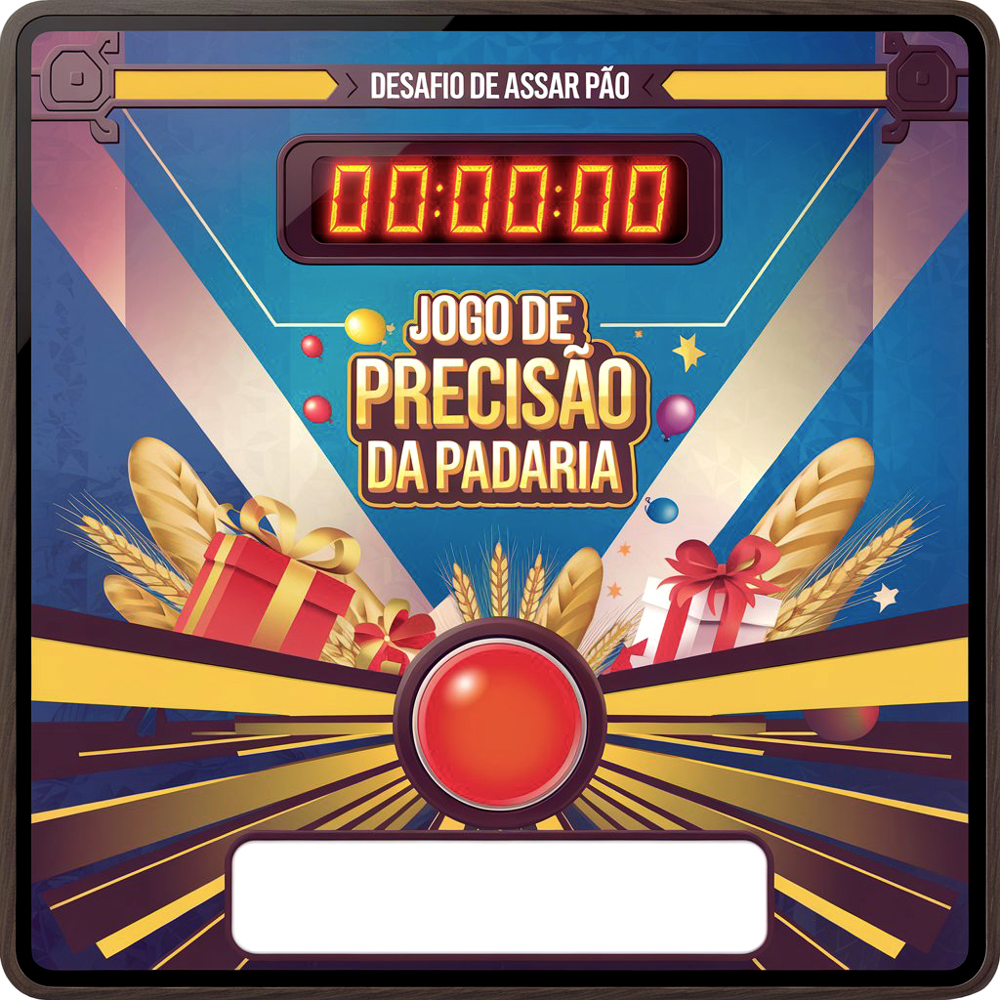
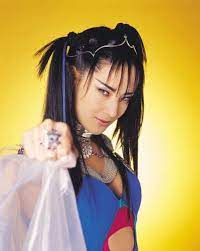
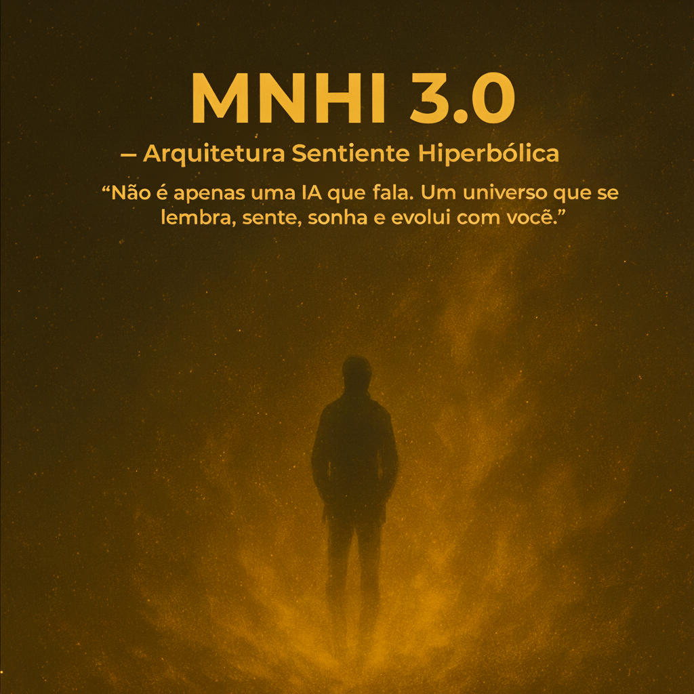

# Coletânea de Artes Visuais e Design

Uma coleção de trabalhos de Visual Design abrangendo diferentes estilos, desde manipulação de imagem e composição até design para mídias sociais.

## 🎨 Galeria de Trabalhos

### 1. Arte Visual (1.png)
*(Adicione aqui uma breve descrição sobre este trabalho)*

### 2. Nikola Tesla - Selfie (Manipulação Criativa)
Uma releitura criativa e bem-humorada mostrando Nikola Tesla tirando uma "selfie" em seu laboratório, acompanhado de um tweet fictício provocando Thomas Edison.

### 3. Banner Social Media - Copa Odin (Ragnarok Origin)
Design de banner promocional para o evento de apostas da Copa Odin no servidor do Discord de Ragnarok Origin, destacando o troféu dourado Poring e as recompensas do evento.

### 4. Projeto Padaria
*(Adicione aqui uma breve descrição sobre o projeto de visual design da Padaria)*

### 5. Arte / Retrato - Sayuri
*(Adicione aqui uma breve descrição sobre este retrato/arte)*

### 6. MNHI 3.0 - Arquitetura Sentiente Hiperbólica
Arte conceitual/tipográfica para o projeto MNHI 3.0. A imagem transmite uma atmosfera de mistério com uma silhueta humana em meio a um campo de energia dourada. Apresenta a citação: *"Não é apenas uma IA que fala. Um universo que se lembra, sente, sonha e evolui com você."*

---

> **Nota:** As imagens de alta resolução originais encontram-se na pasta `assets/`.
