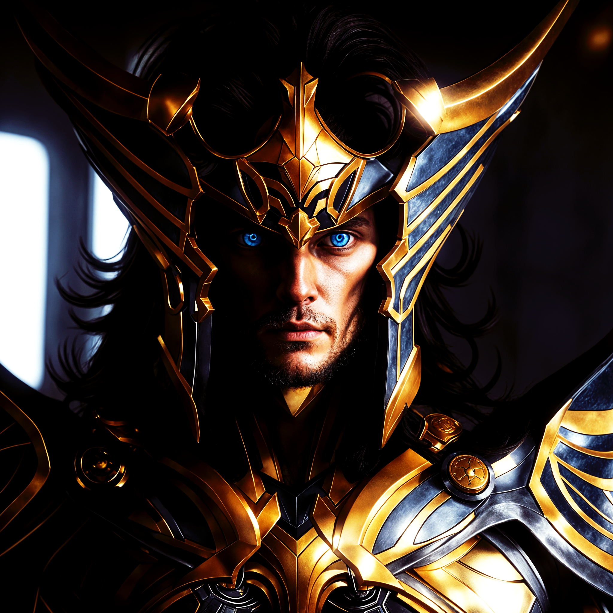
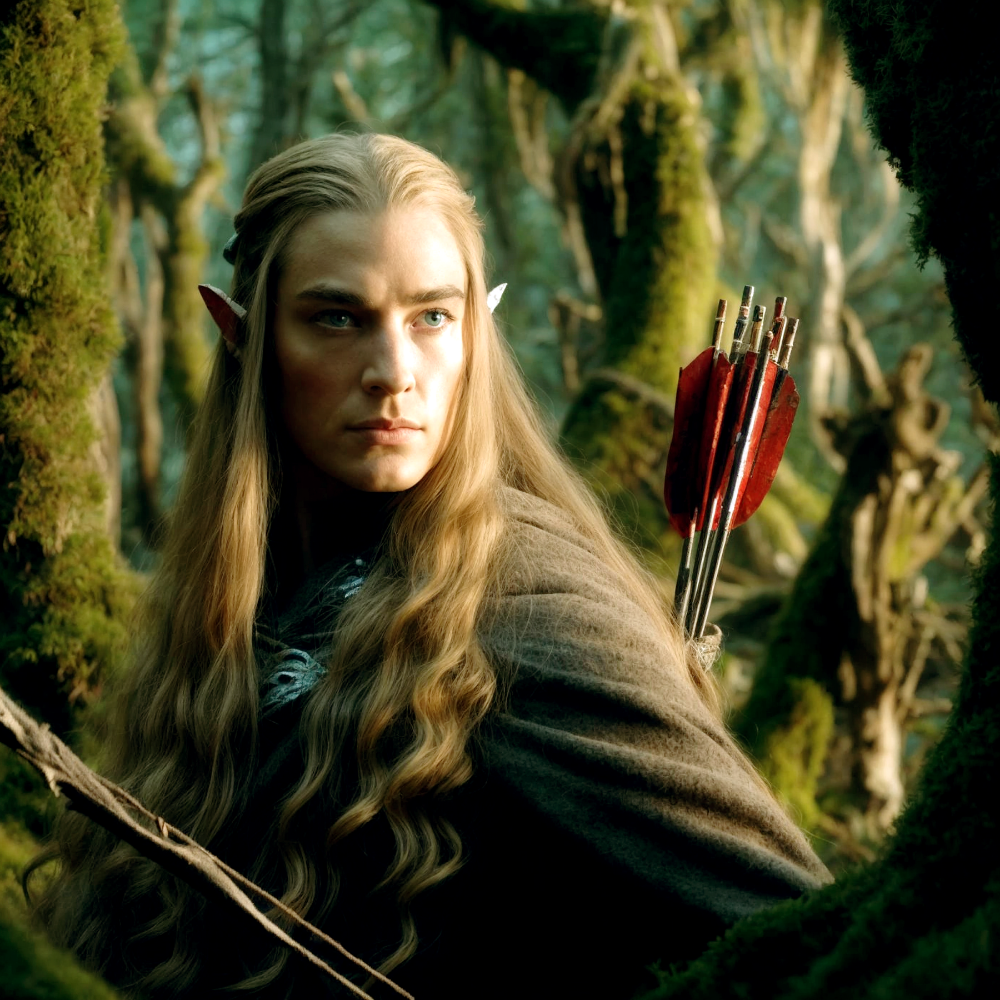
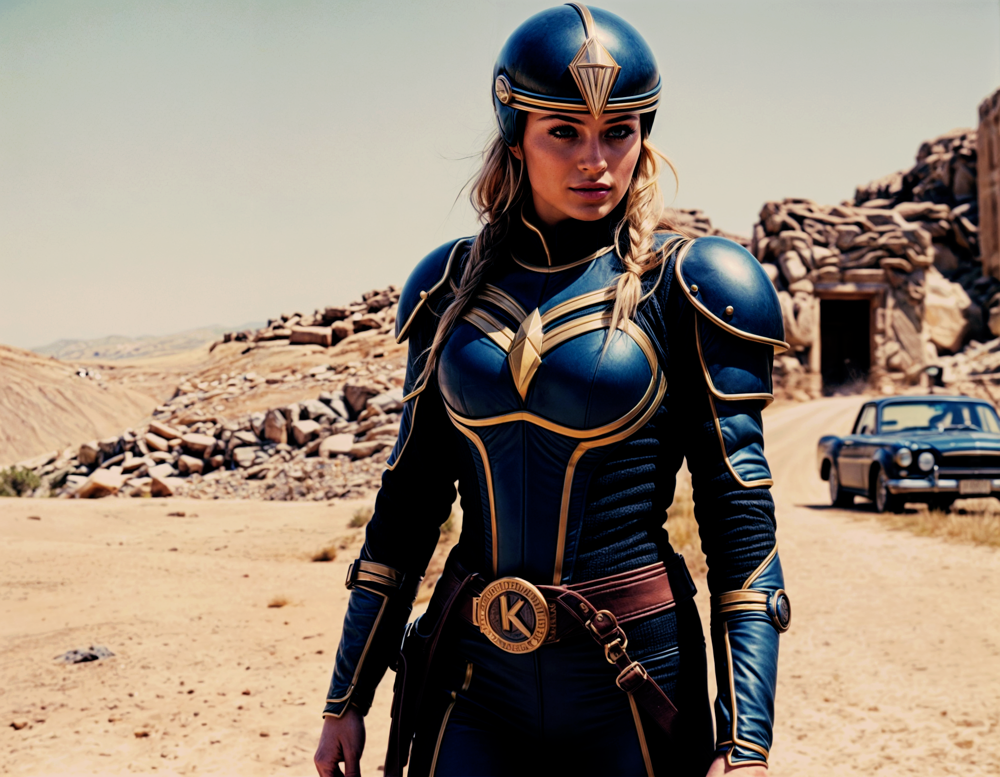
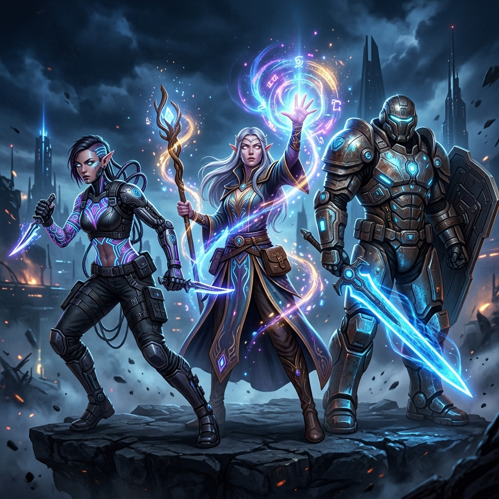
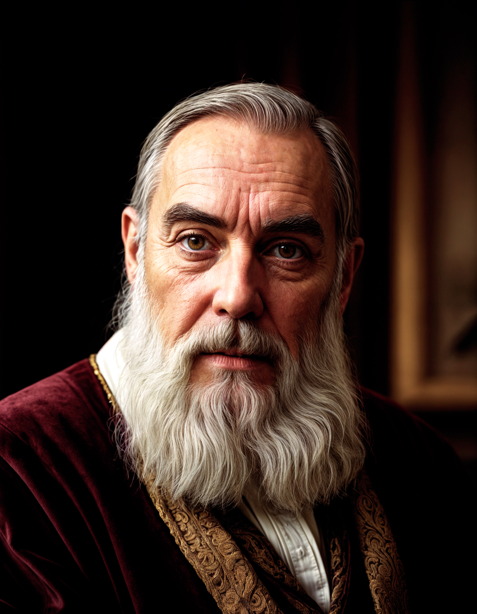
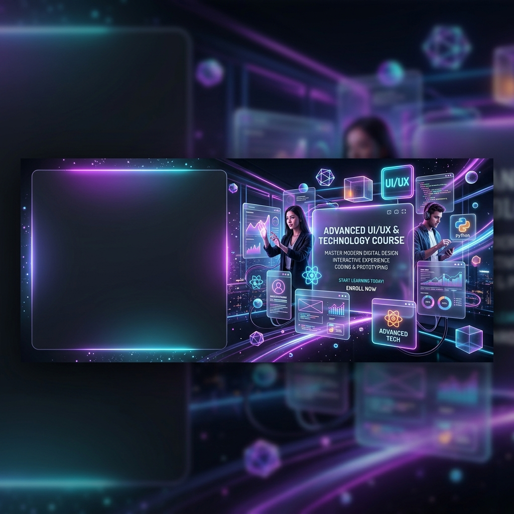
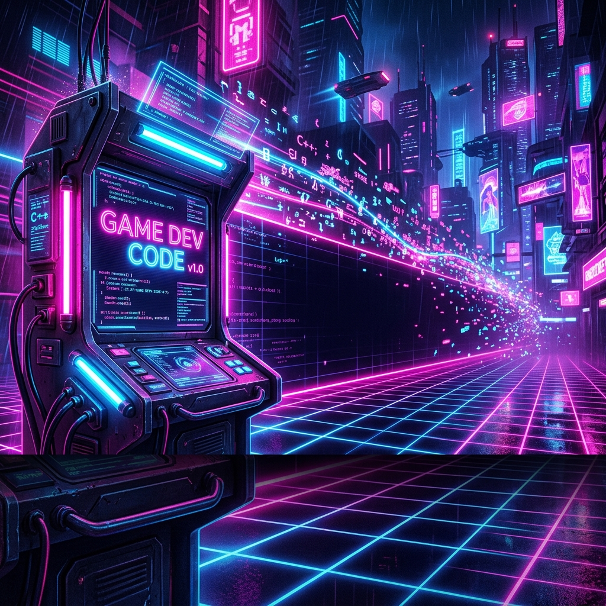
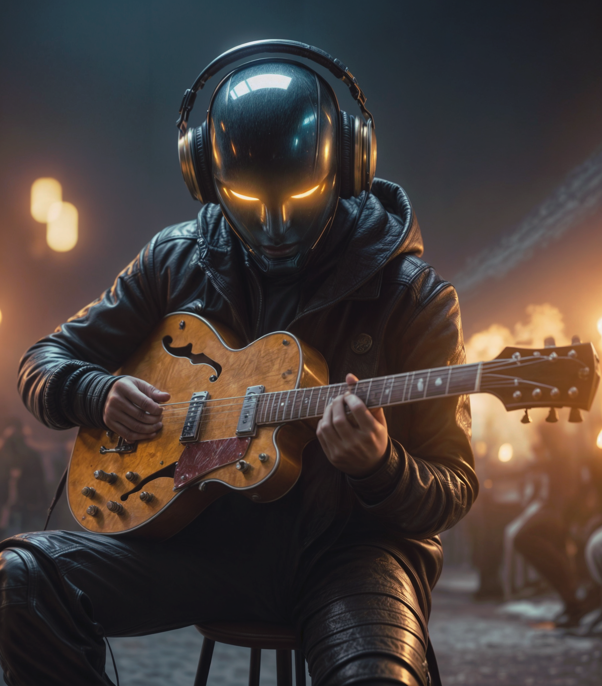
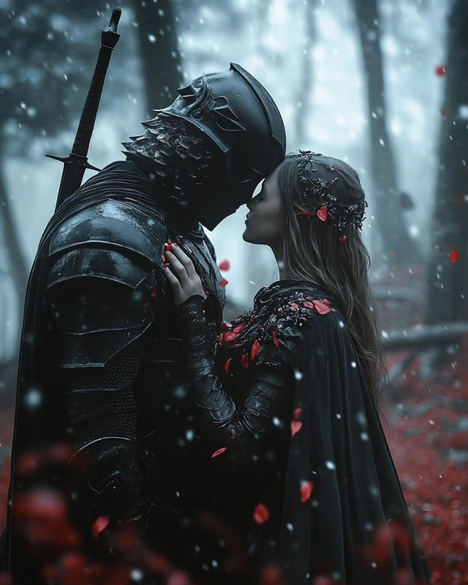

# Coletânea de Artes Visuais e Design

Uma extensa galeria de projetos, manipulações de imagem, concept arts, campanhas para mídias sociais e produções audiovisuais, demonstrando versatilidade em múltiplos estilos de design.

---

## 🧙‍♂️ Concept Art & Personagens (Fantasia e Sci-Fi)

Coleção de ilustrações focadas no desenvolvimento de personagens (Character Design), mundos fantasiosos e cyberpunk.

### Elementos de Arte Frontal (Mago e Dragão)

### Cavaleiro de Zeus

### O Elfo

### Xerife do Futuro

### O Mamute 
.png)

### Concept Art de Equipe (RPG)

---

## 🏛️ Personalidades & Manipulação Histórica

### Nikola Tesla - Selfie Criativa
Uma releitura criativa mostrando Nikola Tesla tirando uma "selfie" em seu laboratório, com um tweet provocando Thomas Edison.

### Galileo Galilei

---

## 🚀 Publicidade & Banners (Social Media e Web)

### MNHI 3.0 - Arquitetura Sentiente

### Banner Ragnarok Origin (Copa Odin)

### Explorações de Campanhas de Cursos
- **Glassmorphism & Neon (UI/UX)**
  
- **3D Claymation (Marketing)**
  
- **Cyberpunk Retrowave (Programação)**
  

---

## 🎨 Branding, Vestuário & Projetos Variados

### Design de Vestuário - UNIFEI / Ciência de Dados

### Identidade Visual - Padaria

### Tech Music

### Retrato - Sayuri

### Estudos Visuais e Conceitos
*(Imagens diversas de conceito, testes de estilo e capturas de processo)*

.png)
.png)

---

## 🎬 Motion Design & Audiovisual

### Cup Anthem
*(Para reproduzir, abra este arquivo em um leitor de Markdown compatível com HTML5)*
<video controls width="100%">
  <source src="assets/Cup%20Anthem%20%E2%80%90%20Feito%20com%20o%20Clipchamp%20(1).mp4" type="video/mp4">
</video>

---

> **Nota:** Todos os arquivos em alta resolução (incluindo vídeos) estão localizados na pasta `assets/`.
